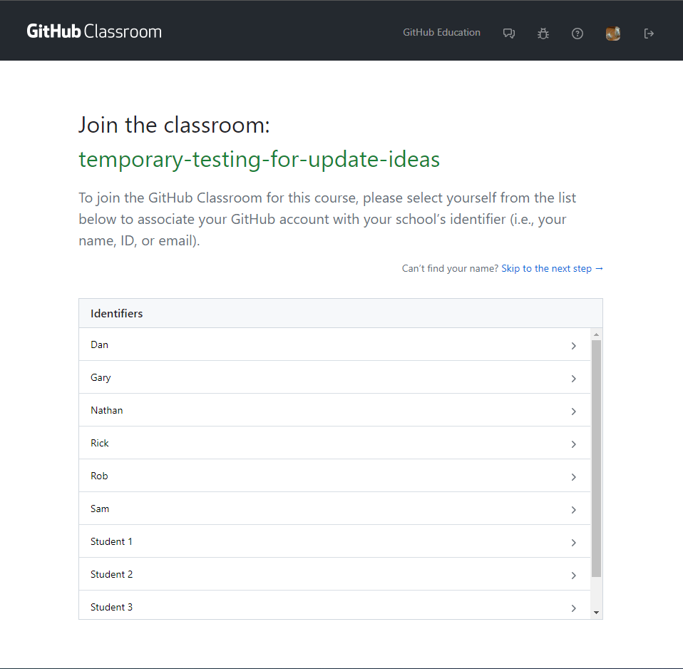
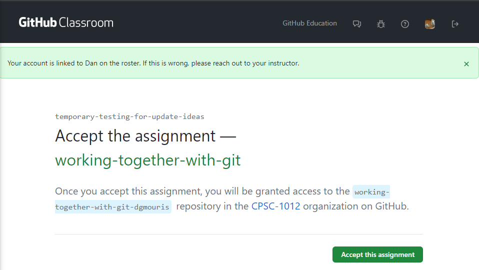
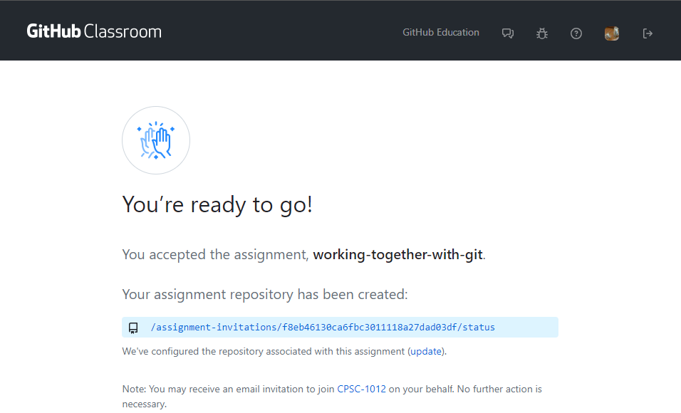

# Exercise Version Control

## Exercise 1
- Using Github Classroom accept the "assignment" for this example.
- Go to the assignment link that your instructor has provided. You should see a page that looks like below. Click on your name.

- Once your name is clicked you should be able to see the following image, click on "Accept this assignment" and wait until your repository is created (this shouldn't take long.)

- Once you refresh the page you should see the following page click on the "Assignment Repository" link and navigate to the repository.

- Push up a change to the README.md file. Take a look at the "Pull Requests" and see that your commit is present in the "Feedback" pull request.
