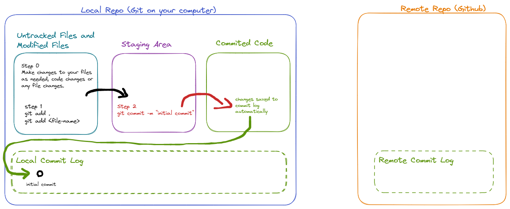
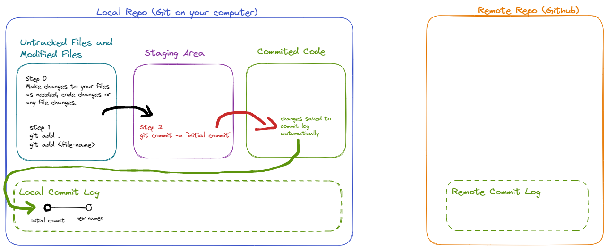
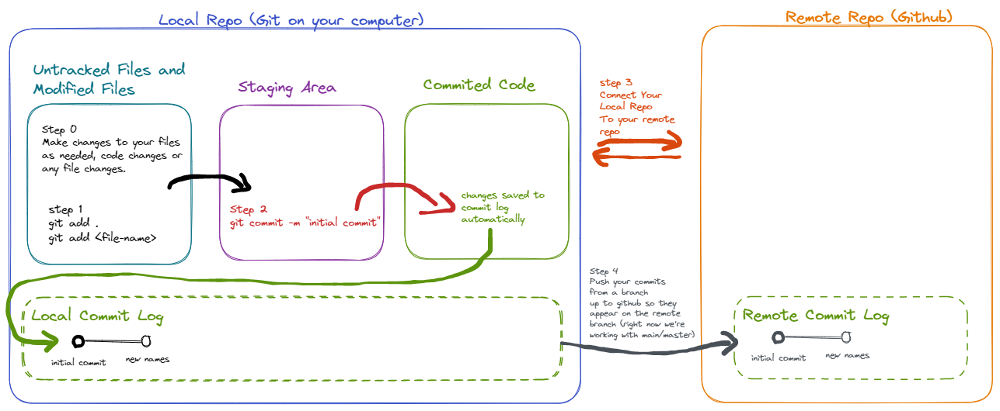
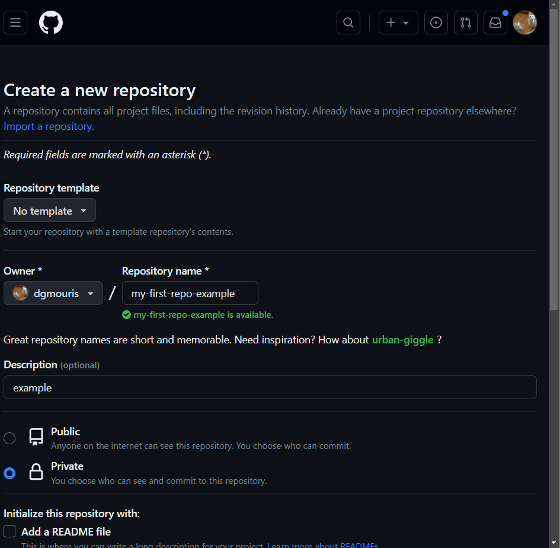
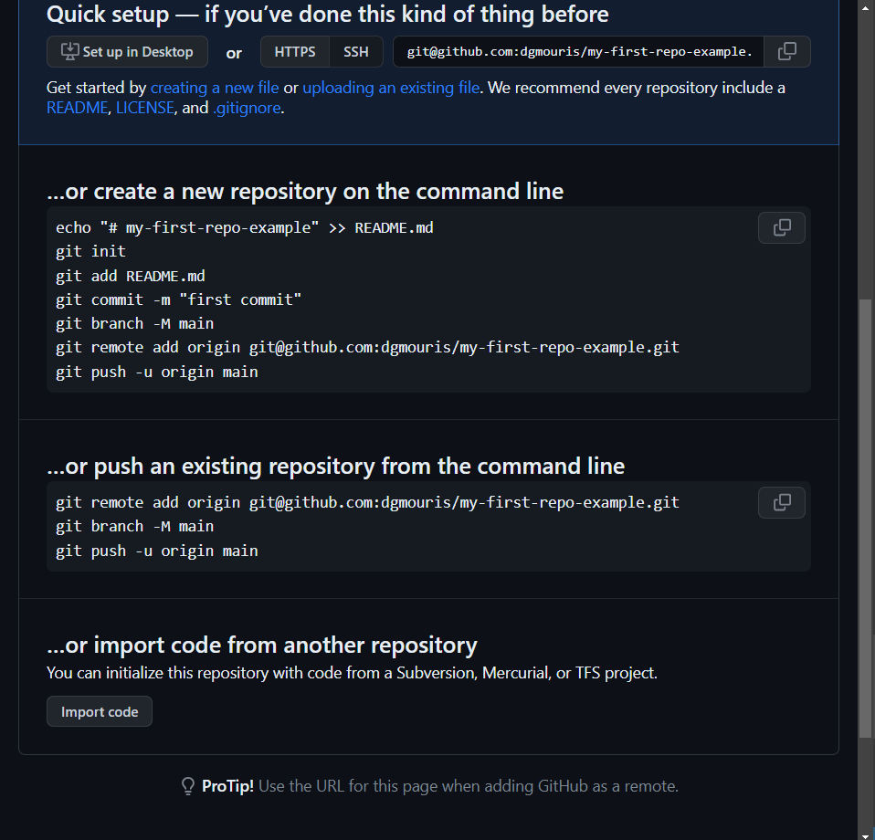
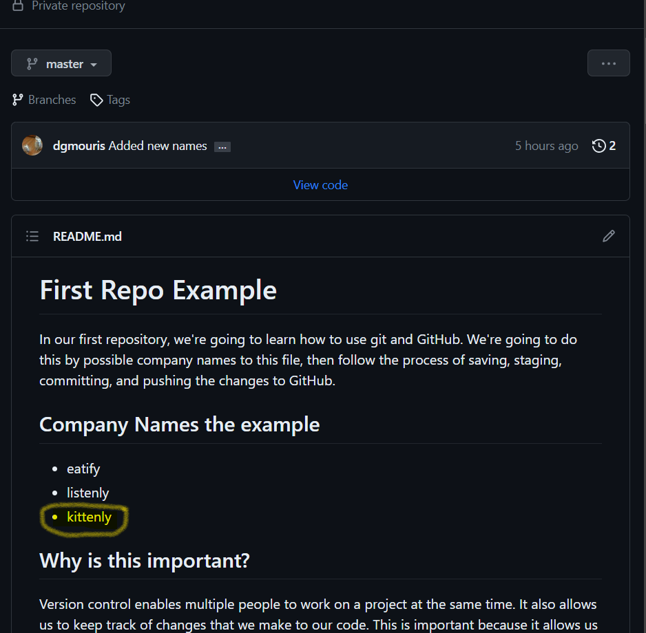
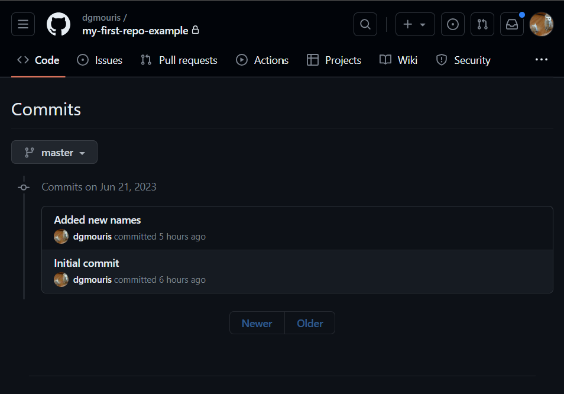

# First Repo Example

In our first repository, we're going to learn how to use git and GitHub. We're going to do this by possible company names to this file, then follow the process of saving, staging, committing, and pushing the changes to GitHub.

## Company Names the example
- eatify
- listenly

## Why is this important?

Version control enables multiple people to work on a project at the same time. It also allows us to keep track of changes that we make to our code. This is important because it allows us to go back to a previous version of our code if we need to. 

You've probably worked on a project before that folks haven't done their share of the work. This is where version control comes in handy. We can see who made what changes and when they made them. This allows us to see who's done what work and when they did it.

You've probably worked on something where you and your classmates want to experiment with different ideas. This is where version control comes in handy. We can create a branch of our code and work on it without affecting the main code. Then when we're ready we can merge our changes back into the main code.

As version control gives you one "Source of Truth" for code that everyone agrees on it's also a great way to collaborate with others. You can work on a project with someone else and not have to worry about who has the most up to date version of the code. You can also work on a project with someone else and not have to worry about them overwriting your changes.

## Useful Git command reference
- `git --version` shows you the version of git that you have installed.
- `git init` initializes a repository and creates a `.git` folder in your 
- `git status` shows you the current status of your repository.
- `git add <file name>` or `git add .` adds your untracked/changed files to the staging area.
- `git log --graph` shows you the commit log in a graph format (this is just a bit easier to read).
- `git diff` see the difference between the last commit and the current state of untracked/modified files.
- `git diff --staged` shows the difference between the last commit and the staging area.
- `git remote -v` shows you the remote repositories that you have connected to your local repository.
- `git remote add origin <remote url>` adds a remote repository to your local repository.
- `git push --set-upstream origin master` pushes your changes to the remote repository and sets the upstream branch. You can think of this as connecting your local branch to the remote branch.
- `git push origin` pushes your changes to the remote repository (once it's been connected with the previous command).

## Steps

### 1. Check if git is installed and install it if it isn't.
- Open up a terminal window.
- Type `git --version` and press enter. The output should look a bit like below
```
$ git --version
git version 2.39.2.windows.1
```
- if after you type `git --version` you get the following
```
$ git --version
'git' is not recognized as an internal or external command,
operable program or batch file.
```
- You'll need to install the "Git" 
  - You can download [**GitHub Desktop here**](https://docs.github.com/en/desktop/installing-and-configuring-github-desktop/installing-and-authenticating-to-github-desktop/installing-github-desktop#about-github-desktop-installation)
    - This gives a bit more of a GUI interface to Git and GitHub.
    - This will also install "git" so that we can access it from the terminal.
    - If you want to use this that's alright, but we're going to be using the terminal for this example. For the rest of the course, you'll get to choose which one you want to use.
  - You can also download [**Just the command line tool here**](https://github.com/git-guides/install-git#install-git-on-windows)
    - which has guides to install git on Windows, Mac, and Linux.
- You'll need to configure git with your name and email address. You can do this by using the following commands in your terminal. This is needed so that there's an author for the commits that you make and that's what we're going to be doing here.
```
$ git config --global user.name "I AM STUDENT NAME"
$ git config --global user.email "supercoolstudentemail@pets.com"
```
- if you want to check that this worked you can use the following command to see your configuration. 
```
$ git config --global --lis
user.name=Daniel Mouris
user.email=dgmouris@gmail.com
```
- Once you see output like the above image you're good to go!

### 2. Let's Create a Repository Locally and observe the status of the repo.
- In your terminal, let's navigate to this directory.
  - In the example below our folder is in the "path/to/this" directory and we navigate using `cd` (change directory) to get to the "my-first-repo-example-start" directory.
  - the `dir` command is used to list the files and folders in the current directory.
    - We're going to take a look at the output of this together so that you can see what's up.
```
$ cd path/to/this/my-first-repo-example-start
$ dir
```
- Now that we're in this directory we're going to initialize a repository using `git init`.
```
$ git init
Initialized empty Git repository in C:/Users/dmouris/path/to/this/my-first-repo-example-start/.git/
```
- Now that we've initialized a repository we can use `git status` to see what's going on.
  - This is going to be a command that is very useful to you as you're working with git as it tells you information about
    - the files that have changed
    - the branch you're on
    - the files that are staged
  - below is a sample output of `git status` after we've initialized a repository.
```
$ git status
On branch master

No commits yet

Untracked files:
  (use "git add <file>..." to include in what will be committed)
        README.md
        git-diagram.excalidraw.png

nothing added to commit but untracked files present (use "git add" to track)
```
- observe here that from the status you can see that:
  - we're on the "master" branch (we'll discuss what this means later)
  - We have no commits (we'll discuss this soon)
  - We have some untracked files (we haven't committed them yet, we'll discuss this soon)
    - `README.md` (what we'll be changeing)
    - some other files as well that we're not going to touch as much.

### 3 Let's talk about the flow of how Git works locally.
- Let's talk about the flow of git locally as we have "Untracked Files" in the previous step. We're going to do this by looking at the diagram below.

- Let's talk about the different areas of git and the process of getting there.
  - **untracked** files (in teal); are files that git doesn't know about. We can add them to the staging area by using `git add <file name>` or `git add .` to add all the files in the current directory.
  - **changed** files (in teal); are files that git does know about but have been changed since the last commit. We can add them to the staging area by using `git add <file name>` or `git add .` to add all the files in the current directory. Note: here that we don't have any changed files because we have no commits.
  - **staged** files (in purple); are files that git knows about and are ready to be committed. You can think of this a "pre-commit" area where changes are ready to be committed and aren't "untracked/changed". We can commit them by using `git commit -m "message"` (where the message describes the change) to commit the files in the staging area. 
  - **committed** files (in green and commit log); are files that are committed to the repository. Git tracks every change since the creation of the repository. We can see the commit log by using `git log` to see the commit log. Note: the commit log is in the dashed green box in the diagram above.
- Now that we understand how git works locally let's make our first commit.

### 4. Let's make our first commit
- We have some files in our repo let's add them all to the staging area by using `git add .` to add all the files in the current directory.
  - Once you git action it's a good idea to use `git status` to see what's going on.
```
$ git add .
$ git status
On branch master

No commits yet

Changes to be committed:
  (use "git rm --cached <file>..." to unstage)
        new file:   README.md
        new file:   git-diagram-local.excalidraw.png
```
- now you can see that our changes are in the staging area and ready to be committed.
- Let's take a look at the commit log by using `git log` and see if there's anything there.
```
$ git log
fatal: your current branch 'master' does not have any commits yet
```
- This message just means that you don't have any commits yet so we're going to do that now.
- Let's commit our changes by using `git commit -m "Initial Commit"` to commit our changes.
```
$ git commit -m "Initial commit"
[master (root-commit) 1650ba0] Initial commit
 2 files changed, 123 insertions(+)
 create mode 100644 README.md
 create mode 100644 git-diagram-local.excalidraw.png
```
- Great! This worked! Let's take a look at the status and see what we get now.
```
$ git status
On branch master
nothing to commit, working tree clean
```
- This shows us that we have committed all of our files to the repository and we have not made any changes since our last commit.
- Let's take a look at the commit log by using `git log` and see if there's anything there. (note: the `--graph` flag just makes the output look a bit nicer, we'll use this for the rest of the class.)
```
$ git log
commit 1650ba05900e3f125babfac34519ed0c38a888a6 (HEAD -> master)
Author: Daniel Mouris <dgmouris@gmail.com>
Date:   Wed Jun 21 09:42:58 2023 -0600

    Initial commit
```
- You can see here that we have one commit with the message "Initial commit" and the commit hash is `1650ba05900e3f125babfac34519ed0c38a888a6` (you don't need to remember the hash it's just a reference for the future for you folks to use.)
- Congrats! You've made your first commit!

### 5. Let's make some changes to our file and commit them
- The powers of git is how changes are tracked. Let's add a company name to our list at the top of this file and commit it. Just like the last step we're going to go from the staging area to the committed area.
- Our new state will have the "new names" commit in the commit log (dashed green) locally as shown below.
  
  - Let's add a company name to our list at the top of the file and commit. I added "kittenify" to the list and saved the file.
- Let's take a look at the status (using `git status`) and see what we get now. You'll see below that we have a "modified" file. 
```
$ git status
On branch master
Changes not staged for commit:
  (use "git add <file>..." to update what will be committed)
  (use "git restore <file>..." to discard changes in working directory)
        modified:   README.md

no changes added to commit (use "git add" and/or "git commit -a")
```
- We can observe the difference between the last commit and the current state by using `git diff` to see the difference between the last commit and the current state. Take a look at the result below.
```
$ git diff
diff --git a/README.md b/README.md
index 7a94645..e6d1985 100644
--- a/README.md
+++ b/README.md
@@ -5,6 +5,7 @@ In our first repository, we're going to learn how to use git and GitHub. We're g
 ## Company Names the example
 - eatify
 - listenly
+- kittenify

 ## Why is this important?
```
- The company name "kittenify" is added to the list and you can see that it's highlighted in green and has a "+" in front of it. This is the difference between the last commit and the current state.
- Let's add this to the staging area by using `git add .` to add all the files in the current directory, follow this by a `git diff`. You'll see that there's no changes! This is because the file changes have now moved to the "staging area"
```
$ git add .
$ git diff

```
- If we want to see the changes in the "staging area" we need to use `git diff --staged` (the `--staged` flag tells git to show the difference between the last commit and the staging area). Below is the output, you can see that the changes are the same as the previous `git diff` command before we moved it to the staging area.
```
$ git diff --staged
diff --git a/README.md b/README.md
index 7a94645..6d0c502 100644
--- a/README.md
+++ b/README.md
@@ -5,6 +5,7 @@ In our first repository, we're going to learn how to use git and GitHub. We're g
 ## Company Names the example
 - eatify
 - listenly
+- kittenly

 ## Why is this important?
 ```
- Now that we've added our changes to the staging area we can commit them by using `git commit -m "new names"` to commit our changes.
- Let's take a look at the commit log using `git log --graph` and you can see that we have the same commits as our diagram!
```
$ git log --graph
* commit 88316c14575635be7c85be2013a6219ad87d5249 (HEAD -> master)
| Author: Daniel Mouris <dgmouris@gmail.com>
| Date:   Wed Jun 21 10:04:43 2023 -0600
|
|     Added new names
|
* commit 1650ba05900e3f125babfac34519ed0c38a888a6
  Author: Daniel Mouris <dgmouris@gmail.com>
  Date:   Wed Jun 21 09:42:58 2023 -0600

      Initial commit
```
- Great we've made changes and committed them! Let's move on to the next step.

### 6. Let's talk about Working with remotes repositories
- If you want together with a team or contribute to open source projects you'll need to work with remote repositories. Remote repositories are repositories that are hosted on a server somewhere. We're going to use GitHub as our remote repository, but we're going to go over the fundamentals with a diagram to connect what's going on.

- Let's talk about how to connect your local repository so that you can push your changes to GitHub (or what ever you use.)
  - In Step 3 (orange-redish), we need to add the "remote url" to our local repository. We do this by using `git remote add origin <remote url>` where the `<remote url>` is the url of the remote repository. In our case, we're going to use GitHub so we're going to use the url of our GitHub repository. (We're going to do this in the next step).
  - In Step 4 (in silver) you can see that we used `git push` to push our changes to the remote repository. This is how we get our changes from our local repository to the remote repository.
    - and you can see the commits will be the exact same as your local repository commits.
  - Note that these are all going to be on the same branch (we'll talk about branches and pull request in the future).


### 7. Lets signup for Github and create an empty repository.
- If you haven't signed up for GitHub yet, you can do so [**here**](https://github.com/signup)
- Once you have signed up let's create a new repository by clicking on the "+" in the top right corner and selecting "New repository". Once you click it you should see the following screen.

- Once click "create" you should see the following image.

- In the repo you can scroll down to the "Quick setup" section and you'll see the "HTTPS" url. This is the url that we're going to use to connect our local repository to our remote repository. 
  - Note I highly suggest that in the future you use SSH to connect to your remote repository. You can ask your instructor how to do this later on.
- Now let's use this "Quick Setup" section in our local repository.
- In your local terminal enter the command `git remote -v` to see if you have any remote repositories. You should see the following output which should show nothing.
```
$ git remote -v

```
- let's add a remote so that we have the availability to push our changes to GitHub. We're going to use the "HTTPS" url from the GitHub repository and use the command `git remote add origin <remote url>` where the `<remote url>` is the url of the remote repository. In our case, we're going to use GitHub so we're going to use the url of our GitHub repository. (We're going to do this in the next step).
  - Note that here I'm using ssh.
```
git remote add origin git@github.com:dgmouris/my-first-repo-example.git
```
- there's no output from this command, but if you use `git remote -v` you should see the following output. Which confirms that you have a remote repository called "origin" and the url is the GitHub repository.
  - Note you can have multiple remote repositories but we're not going to go over this in this course.
```
$ git remote -v
origin  git@github.com:dgmouris/my-first-repo-example.git (fetch)
origin  git@github.com:dgmouris/my-first-repo-example.git (push)
```
- Now that we have a remote repository let's push our changes to GitHub using the command `git push origin` and you see the following output 
```
$ git push origin
fatal: The current branch master has no upstream branch.
To push the current branch and set the remote as upstream, use

    git push --set-upstream origin master

To have this happen automatically for branches without a tracking
upstream, see 'push.autoSetupRemote' in 'git help config'.
```
- let's follow the instructions and use `git push --set-upstream origin master` to push our changes to GitHub.
```
$  git push --set-upstream origin master
Enumerating objects: 7, done.
Counting objects: 100% (7/7), done.
Delta compression using up to 20 threads
Compressing objects: 100% (7/7), done.
Writing objects: 100% (7/7), 146.36 KiB | 3.25 MiB/s, done.
Total 7 (delta 1), reused 0 (delta 0), pack-reused 0
remote: Resolving deltas: 100% (1/1), done.
To github.com:dgmouris/my-first-repo-example.git
 * [new branch]      master -> master
branch 'master' set up to track 'origin/master'.
```
- in the above you can see the line `branch 'master' set up to track 'origin/master'` this is essentially telling use that we've connected our branches to track and we've pushed up the changes.
- Great! We've pushed our changes to GitHub! Let's take a look at the repository and see if our changes are there.

- We can see that our changes are there
  - all our files are present, and our new company name is there!
- As well if you click the little "commits" (that looks like a clock with 2 beside it) button you can see the commit log. 

- You can see that the commit log is the same as our local repository if you do a `git log --graph` in your local repository.
```
$ git log --graph
* commit 88316c14575635be7c85be2013a6219ad87d5249 (HEAD -> master, origin/master)
| Author: Daniel Mouris <dgmouris@gmail.com>
| Date:   Wed Jun 21 10:04:43 2023 -0600
|
|     Added new names
|
* commit 1650ba05900e3f125babfac34519ed0c38a888a6
  Author: Daniel Mouris <dgmouris@gmail.com>
  Date:   Wed Jun 21 09:42:58 2023 -0600

      Initial commit
```

## Challenge: Make some more changes and push them to GitHub
Let's go through the whole thing once more.
1.  Add a company name to the list and save the file.
2.  Add the file to the staging area.
3.  Commit the file with a message.
4.  Push the changes to GitHub.
5.  View the changes on your remote repository and look at the commits to see that they are the same!

You're going to do this with an exercise as well but you might as well practice.

## Conclusion
If you've gotten this far you've learned the basics of git and GitHub. You've learned how to:
- initialize a repository
- add files to the staging area
- commit files to the repository locally
- push changes to a remote repository

If we have time later we'll take a look at the nuts and bolts of making a Pull Request with a different branch.

As well this is how all code gets written in the real world. You'll be using git and GitHub to collaborate with others and work on projects. This is a great skill to have and will help you in your career.

You can use git and GitHub to contribute to open source! This essentially means you can contribute code, documentation, or anything else to a project that you use. This is a great way to get involved in the community and help others out.
