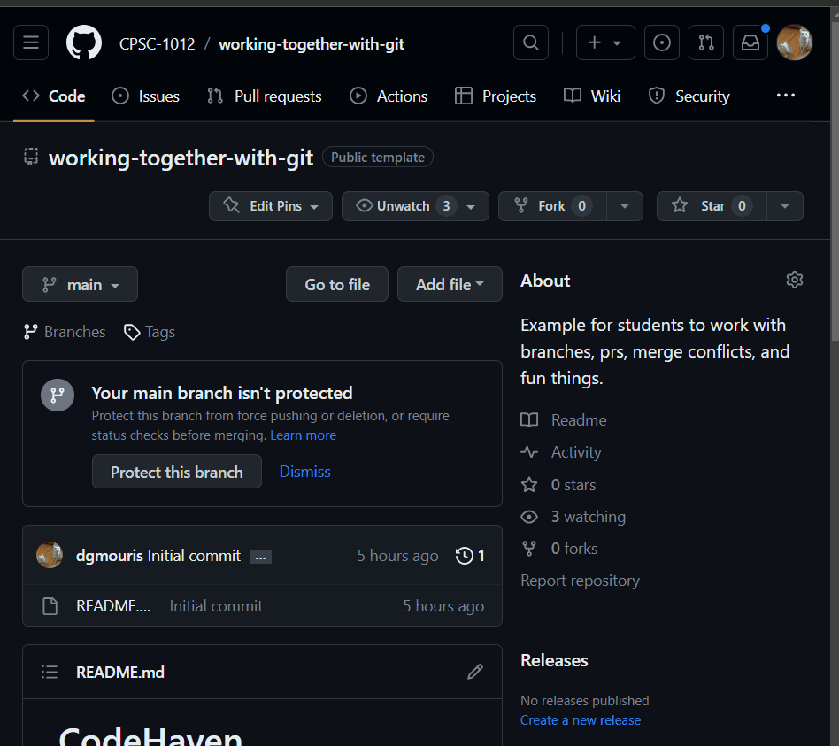
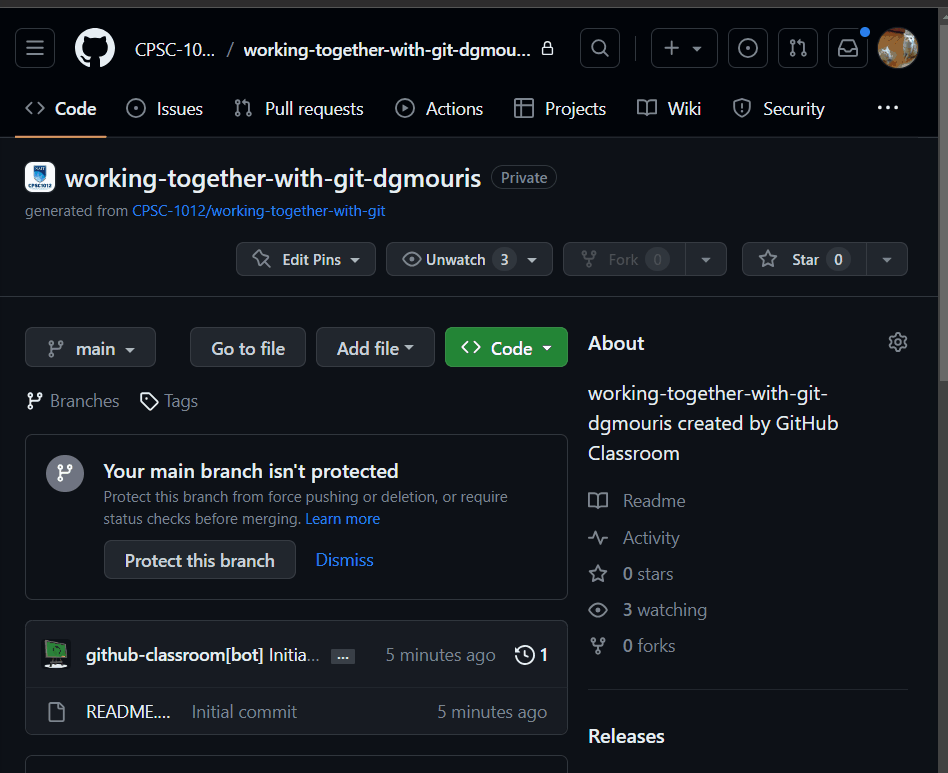
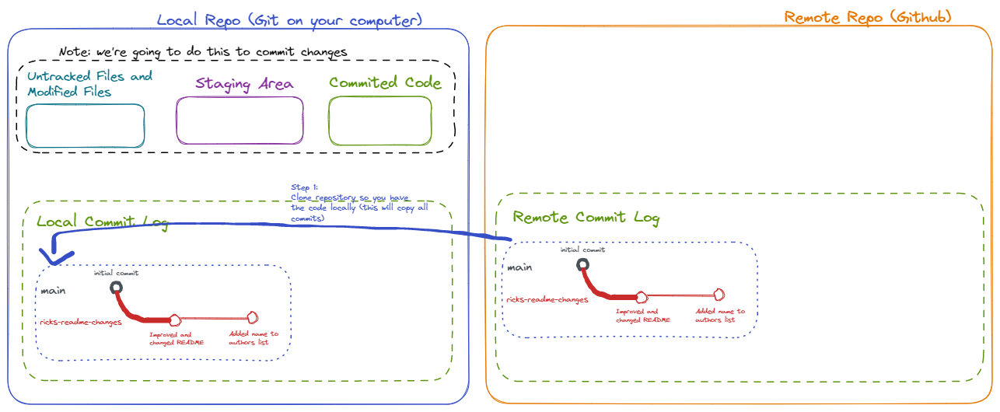
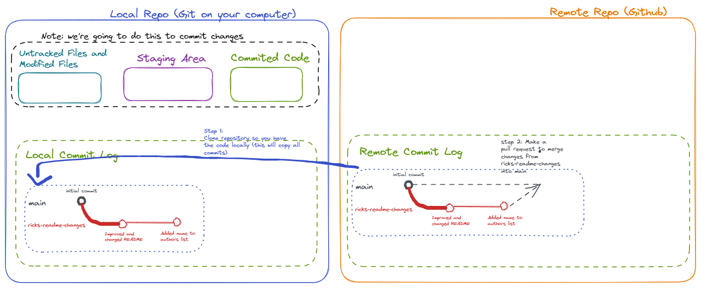
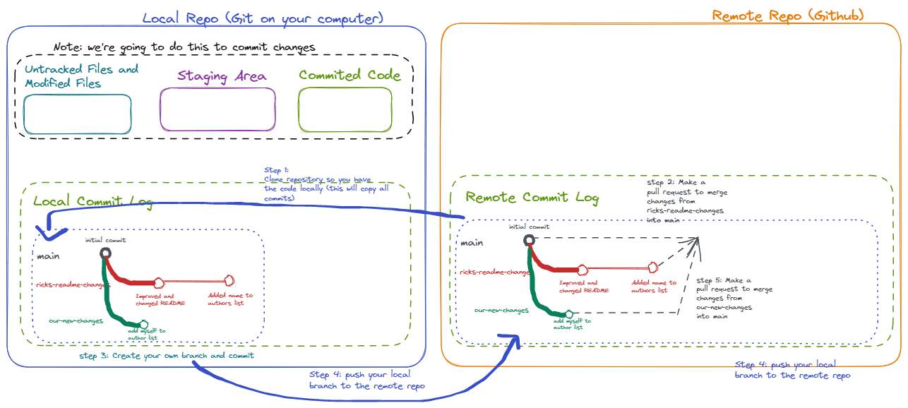
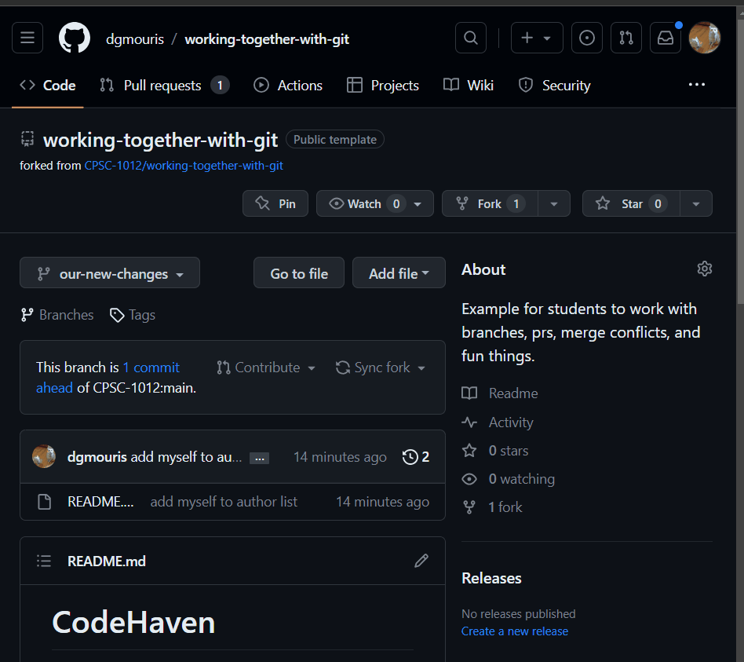
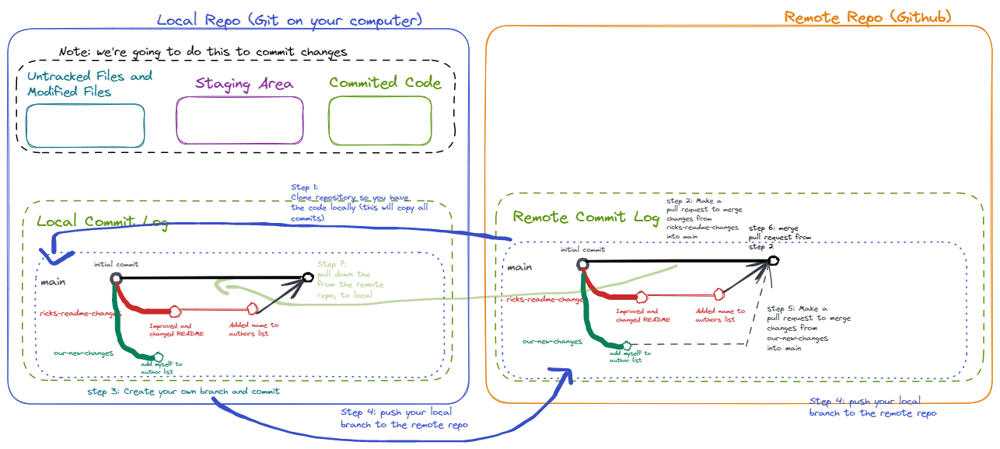
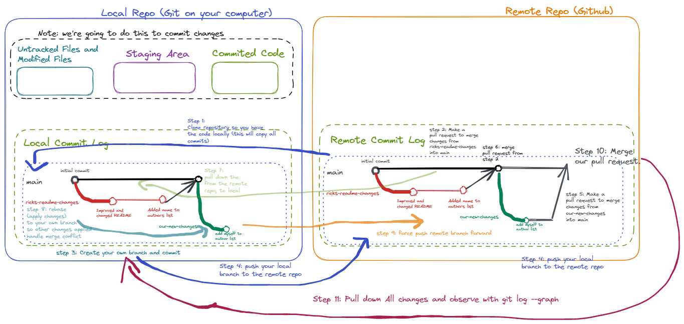
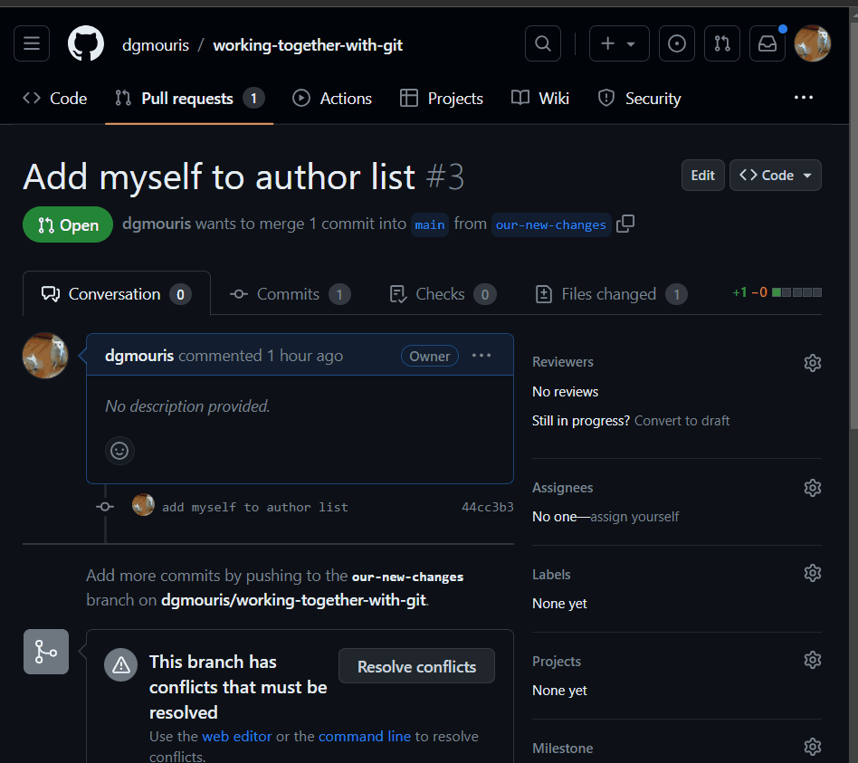
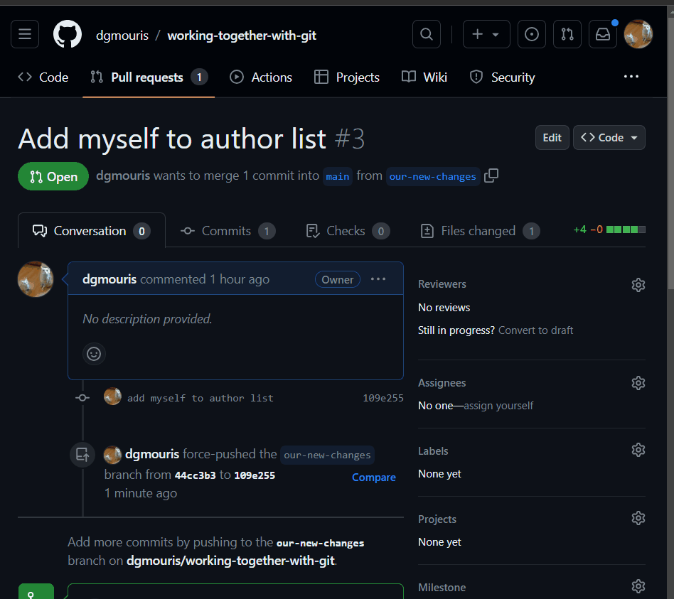

# Working Together with Git.

## Why is this important

Last class we learned how to do the fundamentals of git, but we didn't really talk about how to work with other people or work with an existing project. This class we'll focus on how to work with other people and how to work with an existing project.

## What we're going to cover

We're going to cover the following topics by working with an existing project named "CodeHaven" with our colleague rick (who may or may not exist):

- How to clone an existing project (an existing remote repositry) to your local computer.
- How to create a new branch and push that branch to the remote repository.
    - How to navigate branches on your local project.
- How to create a pull request on github.
- How to merge pull requests on github.
- How to pull down changes from the remote repository.
- How to handle a fundamental merge conflict.

## Useful Git command reference
- (refer to the previous example as well for more commands).
- `code .` opens "VS Code" in the current directory. If you're using a different editor you can open it up in that editor. (Not really a git command but really handy)
- `git clone <remote-repo-url>` clones a remote repository to your local computer, you'll use the for every assignment.
- `git checkout <branch-name>` checks out a branch on your local computer, so that you can work on it.
- `git branch` shows you the branches that you have locally.
- `git branch <new-branch-name>` creates a new branch locally.
- `git push --set-upstream origin <new-branch-name>` pushes a new branch to the remote repository. Note that in more complex setups you can have different remotes so `origin` can be a different remote name.
- `git pull` pulls down changes from the remote repository.
- `git log --graph --oneline` shows you the commits in a graph in a more compact way.

## Steps

### 1. Fork the repository to make your own copy.
- Go the [repository at this link](https://github.com/CPSC-1012/working-together-with-git) and fork it.
- Click the "Fork" button on the repository and select your account as an owner and click "Create Fork." Take a look at the gif below for an example

- This will give you a copy of the repository on your account, that won't affect the original repository.
- We're not going to talk a lot about forks in this course but it's a handy way to make a copy of a repository that you don't own.

### 2. Clone the repository to your computer.
- Let's get the link to clone the repository and clone it to your computer. You can do this by clicking "Code" and copying the link. Look at the following gif for an example.
  - The gif might be using "SSH" but you can use "HTTPS" like you did in the last class.

- Once you have the link you can clone this repository to your computer with the command `git clone <remote-repo-url>`. You can do this by opening up a terminal (navigating to a proper directory with `cd`) and typing the following command:
```
$ git clone git@github.com:CPSC-1012/working-together-with-git-dgmouris.git
Cloning into 'working-together-with-git-dgmouris'...
remote: Enumerating objects: 6, done.
remote: Counting objects: 100% (6/6), done.
remote: Compressing objects: 100% (4/4), done.
remote: Total 6 (delta 0), reused 4 (delta 0), pack-reused 0
Receiving objects: 100% (6/6), done.

```
- Once you have this done navigate to the directory `cd working-together-with-git-dgmouris` and open up the project in VS Code `code .` (or whatever editor you're using.) and then you should be in the next step!
  - Note: `code .` opens "VS Code" in the current directory. If you're using a different editor you can open it up in that editor.

###  3. Let's see what we have in our project locally.
- The first thing to do when you get a new project is just a `git status` (you'll get used to typing this command all the time.)
```
$ git status
On branch main
Your branch is up to date with 'origin/main'.

nothing to commit, working tree clean
```
- You can see here that we don't have anything to commit and we're on the "main" branch.
  - Note the first line of the output "On branch main" will always tell you what branch you're on.
  - we also learned last class about the "origin/main" part of this command. This is the remote repository and the branch that we're connected to.
- Let's take a look at the commit log with `git log --graph`
```
$ git log --graph
* commit aa5ec97a354afd3e8b2872a1a8fea4684a8d2b2a (HEAD -> main, origin/main)
  Author: Daniel Mouris <dgmouris@gmail.com>
  Date:   Thu Jun 22 10:04:20 2023 -0600

      Initial commit
```
- You can see here that we have one commit.
- We're going to talk about branches in the next step but Let's take a look a new command named `git branch` to see what branches we have locally
```
$ git branch
* main
  ricks-readme-changes
```
- You can see here that we have two branches, the "main" branch and the "ricks-readme-changes" branch.
  - The star in front of main means that you're currently on that branch.

### 4. Let's Branch Out! Let's talk about the branches in our project.
- Let's take a look at the following diagram to see what we've done in the previous step.

- Let's talk about what we've done in the previous step.
  - In Step 1 (blue), we have clone the remote repository to our local computer so that we have a copy of Everything that is going on.
  - We have two branches here `main` (in silver) and `ricks-readme-changes` (in red) and we're currently on the `main` branch, these have different changes in them but they're all starting from the commit with the name "Initial commit" (this is going to be important later.)

- Rick has made some changes to the README.md file in the `ricks-readme-changes` and has pushed those changes to the remote repository. He didn't want to change the original project because he wanted your feedback on the changes he made. So he created a new branch and pushed that branch to the remote repository.
  - Since you have cloned this repository you have pulled down all of the branches and commits that Rick has made.
  - You are also on this project and you are expected to make some changes as well. We are also going to create a branch a push it to the remote repository so that we can discuss changes and agree on what we want to do (we're going to do this shortly.)
- Let's take a look at the changes that git rick has made by **Checking out** his branch with the command `git checkout ricks-readme-changes`
```
$ git checkout ricks-readme-changes
Switched to branch 'ricks-readme-changes'
Your branch is up to date with 'origin/ricks-readme-changes'.
```
- You can see here that we have switched to the branch `ricks-readme-changes` and we're up to date with the remote repository, let's take a look at what we get from `git status`
```
$ git status
On branch ricks-readme-changes
Your branch is up to date with 'origin/ricks-readme-changes'.

nothing to commit, working tree clean
```
- Observe the line `On branch ricks-readme-changes` in the output. You can see that we're no longer on the branch `main` but we're on the branch `ricks-readme-changes`.
- Let's take a look at what we get from `git log --graph`
```
$ git log --graph
* commit 4d0eaa86a2655c26ae8340e8169b65a503f6d0f9 (HEAD -> ricks-readme-changes, origin/ricks-readme-changes)
| Author: Daniel Mouris <dgmouris@gmail.com>
| Date:   Thu Jun 22 10:08:18 2023 -0600
|
|     Added name to authors list
|
* commit d86fe70da2d291a06f35faa0ae00682db7c87d5e
| Author: Daniel Mouris <dgmouris@gmail.com>
| Date:   Thu Jun 22 10:07:22 2023 -0600
|
|     Improved and changed README
|
* commit aa5ec97a354afd3e8b2872a1a8fea4684a8d2b2a (origin/main, main)
  Author: Daniel Mouris <dgmouris@gmail.com>
  Date:   Thu Jun 22 10:04:20 2023 -0600

      Initial commit
```
- Observe here that there's two new commits (made by dan we know he's not Rick) and that the `HEAD` is on the branch `ricks-readme-changes` and that the `origin/ricks-readme-changes` is also on the branch `ricks-readme-changes`.
  - The `HEAD` is the commit that you're currently on.
  - The `origin/ricks-readme-changes` is the commit that the remote repository is on.
- If you refer back to the diagram you can see that there's added commits to the `ricks-readme-changes` branch that are not on the `main` branch.
- Let's take a look at the differences between the branch `ricks-readme-changes` and `main` by using the command `git diff origin/main`
```
$ git diff origin/main
diff --git a/README.md b/README.md
index 97f5a3b..12f7f78 100644
--- a/README.md
+++ b/README.md
@@ -2,15 +2,18 @@

 ## Project Authors
 - Dan Mouris
+- Rick Idonotexistdotcom

 ## What is CodeHaven?
-CodeHaven is an open-source project dedicated to fostering collaboration, learning, and innovation in the coding community. Our mission is to provide a welcoming and inclusive environment where developers of all levels can come together to share knowledge, contribute to projects, and expand their skills.
+CodeHaven is an innovative platform that brings together developers from all backgrounds to explore, create, and collaborate on coding projects. It serves as a sanctuary for passionate coders, providing a supportive and inspiring environment to fuel their creativity.

 ## Features and Highlights
-Community-driven: CodeHaven thrives on the collective expertise and passion of its members. Join us to connect with like-minded individuals, ask questions, and engage in meaningful discussions.
+**Community Empowerment**: CodeHaven is driven by a strong sense of community. We believe in the power of collaboration and knowledge-sharing. Join our vibrant community to connect with talented developers, exchange ideas, and uplift one another.
```
- This was only a snippet of the output and it isn't the nicest to look at, we're going to take a look at how to see this in GitHub in the next step.
- As well if you observe the README.md that the README.md file is different.
- Checkout the `main` branch with the command `git checkout main` before going to the next step.
```
$ git checkout main
Switched to branch 'main'
Your branch is up to date with 'origin/main'.
```
- In the following steps we're going to talk about a couple of things.
  - how to create our own branches locally and push them to the remote repository.
  - how to merge these changes into the `main` branch. On our remote repository.

### 5. Let's Create a Pull Request from `ricks-readme-changes` and Merge it in the `main` branch
- Below is a diagram that shows the visualization of what this looks like.

- The pull request shown in Step 2 (in dashed dark gray) is what a pull request is. Note that this is all happening on the remote repository.
  - A pull request is essentially a way to ask the owner of the repository to merge your changes into the main branch. In this example we're going to merge the changes of `ricks-readme-changes` into the `main` branch. This is a way to discuss changes and make sure that the changes are what you want.
  - If the code is merged (it's not a certainty) then the changes will be merged into the `main` branch and the `main` branch will be updated.
- Let's create a merge request on github (our remote repository)
  - We're going to take the branch "Across the fork" which we're going to include.

- In the Gif Above you see that we're creating a pull request let's talk about the steps to create this on github.
  - Click on the "Pull Requests" tab on the repository and click "New Pull Request"
  - on the "Open a Pull Request" page click on the "compare across forks" link. The top drop-down under "Comparing Changes" should be your repository in the main branch.
  - The bottom drop-down under "Comparing Changes" should be the "ricks-readme-changes" branch from the CPSC-1012 organizations' repository.
  - After you've done this Click on the "Create Pull Request" button.
- Let's navigate through the "Pull Request" tab with an *Open Pull Request* in there (you can think of it as *Unmerged*) and see what we have.

  - In this "Pull Request" tab you can see that we have our newly created pull request, and we click on it.
  - In the "Pull Request" itself you can see that there are a few sections.
    - **Conversation** is where you can have a conversation about the changes that you're making. This is a good place to ask questions and discuss the changes that you're making.
    - **Commits** is where you can see the commits that are included in the pull request.
    - **Files Changed** is where you can see the files that are changed in the pull request. This is going to have a "diff" of the changes.
      - on the left side of the diff you can see the original file and on the right side you can see the new file.
      - The red lines are lines that are removed and the green lines are lines that are added.
- Congrats you've just made a pull request on GitHub! Leave this open and let's make a pull request of our own (before we merge this one).
  - Note This was step 2 in the diagram of the previous step.

### 6. Let's create a branch locally and push it up to the remote repository
- Let's take a look at our diagram again and talk about how we're going to work with Rick in this repository and make our own pull request with our own branch.

  - In Step 3 (in teal-green), we're creating a new branch locally and making a commit. In the commit, all we're going to do is add our names to the author list.
  - In Step 4, (in blue-purple) we're pushing our branch up to the remote repository so that it's available for Rick and the rest of our imaginary team to see.
  - In Step 5, (in silver) we're creating a pull request on the remote repository from our branch `our-new-changes` into `main` branch and keeping it open like the last step.
- Let's do this and start by creating a branch locally.
- Execute the `git branch` command in your terminal. This is going to show you the branches you have locally. You can see in the output that we only have the `main` branch locally and that we're on the `main` branch because there's a star in front of it.
```
$ git branch
* main
```
- Let's create a new branch locally with the command `git branch our-new-changes` and then list our branches with `git branch` again.
```
$ git branch our-new-changes

$ git branch
* main
  our-new-changes
```
- You can see that `git branch <new-branch-name>` creates a new branch but doesn't show any output.
- You can see that we have a new branch named `our-new-changes` but we're still on the `main` branch because there's the `*` in front of it.
- Let's **Checkout** this branch with the command `git checkout our-new-changes` and do a `git branch`. The star is now in front of the `our-new-changes` branch.
```
$ git checkout our-new-changes
Switched to branch 'our-new-changes'

$ git branch
  main
* our-new-changes
```
- Let's now make a change to the README.md file and add our name to the author list. Open up the README.md file in your editor and add your name to the author list and save the file.
```markdown
# CodeHaven

## Project Authors
- Dan Mouris
- Your Student Name Here

Rest of the README.md file omitted...
```
- Let's now go through the steps from last class.
  - Add it to the staging area `git add README.md`
  - Commit it to the local repository `git commit -m "add myself to author list"`
  - Below is the output with `git status` between each command so that you can see the state. Note that you can use `git log --graph` to see now that you've added one commit to the history.
  - This completes step 3 in our diagram above.
```
$ git status
On branch our-new-changes
Changes not staged for commit:
  (use "git add <file>..." to update what will be committed)
  (use "git restore <file>..." to discard changes in working directory)
        modified:   README.md

no changes added to commit (use "git add" and/or "git commit -a")

$ git add README.md

$ git status
On branch our-new-changes
Changes to be committed:
  (use "git restore --staged <file>..." to unstage)
        modified:   README.md

$ git commit -m "add myself to author list"
[our-new-changes 44cc3b3] add myself to author list
 1 file changed, 1 insertion(+)

$ git status
On branch our-new-changes
nothing to commit, working tree clean
```
- Let's push this branch up to the remote repository with the command `git push` which will tell us to use the command `git push --set-upstream origin our-new-changes` so that the remote repo can create a branch with the same name.
```
$ git push
fatal: The current branch our-new-changes has no upstream branch.
To push the current branch and set the remote as upstream, use

    git push --set-upstream origin our-new-changes

To have this happen automatically for branches without a tracking
upstream, see 'push.autoSetupRemote' in 'git help config'.

$ git push --set-upstream origin our-new-changes
Enumerating objects: 5, done.
Counting objects: 100% (5/5), done.
Delta compression using up to 20 threads
Compressing objects: 100% (2/2), done.
Writing objects: 100% (3/3), 304 bytes | 304.00 KiB/s, done.
Total 3 (delta 1), reused 0 (delta 0), pack-reused 0
remote: Resolving deltas: 100% (1/1), completed with 1 local object.
remote:
remote: Create a pull request for 'our-new-changes' on GitHub by visiting:
remote:      https://github.com/dgmouris/working-together-with-git/pull/new/our-new-changes
remote:
To github.com:dgmouris/working-together-with-git.git
 * [new branch]      our-new-changes -> our-new-changes
branch 'our-new-changes' set up to track 'origin/our-new-changes'.
```
- Great if you see a similar output you've pushed up your changes (this completes step 4 in our diagram)! Let's be sure and take a look at GitHub. It should look something like this.

    - There's a handy button for "Compare and Pull Request" and if click on the "View All Branches" you'll see that your branch is there!
- Click on the "Compare and Pull Request" button and you'll see the following.

- We selected the "main" branch as the base branch and the "our-new-changes" branch as the compare branch.
  - This is going to create a pull request from our branch into the main branch.
  - We also selected our own repository as the base repository for both branches.
  - We took a look at the commits and the changes and that was the same as we did in our editor.
  - This is completing step 5 in our diagram above.

### 8. Merging A Pull Request and pulling down changes
- In this next part we're going to merge our pull requests, and deal with the "scary" stuff of git (merge conflicts) by using rebase.
- Let's take a look at the diagram below to see what we're going to do.

  - In Step 6 (in bold-black) We merge the pull request on github and we'll show what this looks like.
  - In Step 7 (in faded-green) we pull down all of the changes from our remote repository and we'll observe that the merged code is now a commit on our local repo.
- Let's merge the pull request from Rick in our project and observe the commits.

  - We click on the pull request and we add a comment (this is a very simplified review process).
  - Then we click on the "Merge Pull Request Button" and then we click on the "Confirm Merge" button.
  - After we see this we can see that the pull request is merged and we can see the commits in the "Commits" tab and see that we have new commits.
  - You can also see this in the README.md file in the "Code" tab, that under authors we have `Rick Idonotexistdotcom`.
  - This completes step 6 in our diagram above.
- Locally let's see that we don't have these changes with the git on the main branch (`git log --graph --oneline` just displays our log in a bit more of a compact fashion)
```
$ git checkout main
Switched to branch 'main'
Your branch is up to date with 'origin/main'.

$ git log --graph --oneline
* aa5ec97 (HEAD -> main, origin/main, origin/HEAD) Initial commit
```
-
- Let's now pull down the changes from the remote repository with the command `git pull` and observe the output.
```
$ git pull
remote: Enumerating objects: 9, done.
remote: Counting objects: 100% (9/9), done.
remote: Compressing objects: 100% (4/4), done.
remote: Total 7 (delta 1), reused 6 (delta 1), pack-reused 0
Unpacking objects: 100% (7/7), 2.00 KiB | 76.00 KiB/s, done.
From github.com:dgmouris/working-together-with-git
   aa5ec97..e8db253  main       -> origin/main
Updating aa5ec97..e8db253
Fast-forward
 README.md | 13 ++++++++-----
 1 file changed, 8 insertions(+), 5 deletions(-)

$ git log --graph --oneline
*   e8db253 (HEAD -> main, origin/main, origin/HEAD) Merge pull request #1 from CPSC-1012/ricks-readme-changes
|\
| * 4d0eaa8 Added name to authors list
| * d86fe70 Improved and changed README
|/
* aa5ec97 Initial commit
```
- Now if you look at the output you can observe a couple of things.
  - the pull command has pulled down the changes from the remote repository and merged them into the local repository.
  - it also has `Fast-forward` in the output. This means that the changes were able to be merged without any conflicts and the commits have moved forward.
  - Under the output of the `git log --graph --oneline` you see the commits have changed and that the `HEAD` is on the `main` branch.
- If you open your VS Code and look at the README.md file you can see that the changes have been merged into the file.
```markdown
# CodeHaven

## Project Authors
- Dan Mouris
- Rick Idonotexistdotcom

Rest of the README.md file omitted...
```
- This completes step 7 in our diagram above.
- Awesome you've merged a pull request and seen the changes locally! 95% of the time this is going to be your workflow. You're going to pull down changes from the remote repository and continue to work on your project.
- Sometimes though two people modify the same line on the same file and this called a merge conflict. We're going to talk about how to handle this in the next step.

### 9. Handling Merge Conflicts using `git rebase`
- Let's take a look at the diagram below to see what we're going to do.

  - When we observe GitHub there's a merge conflict and we're going to handle this merge conflict locally.
  - In Step 8 (in faded-teal) we use `git rebase` to "replay" our `our-new-changes` commits on top of the `main` branch so that we can handle the merge conflict.
  - In Step 9 (In faded orange) we use `git push --force` to push our changes up to the remote repository, we'll need to use `--force` because our commits will have now diverged.
    - Note that this is a bit of an advanced topic but we'll go over it.
    - This makes it so that we all of the changes in both repositories.
  - In Step 10 (In dark-gray) we merge the pull request of `our-new-changes` on GitHub and we'll see what this looks like.
  - In Step 11 (In dark-red) we pull down the changes and observe that the merge conflict is resolved and we have all of our changes and our nice commit history.
- Let's take a look and see what our merge conflict looks like on GitHub.

  - You can see that there's a message on the Pull Request that says "This branch has conflicts that must be resolved" and there's a button that says "Resolve Conflicts"
  - Click on the button just to observe what it looks like. You can fix these on GitHub but there's a lot of power in doing this locally.
- Let's checkout `our-new-changes` branch locally and see the commits that we have, you'll observe that we don't have the new commits from the `main` branch.
```
$ git checkout our-new-changes
Switched to branch 'our-new-changes'
Your branch is up to date with 'origin/our-new-changes'.

$ git log --graph --oneline
* 44cc3b3 (HEAD -> our-new-changes, origin/our-new-changes) add myself to author list
* aa5ec97 Initial commit
```
- Let's use `git rebase` to apply the `main` branch `commits` on the `our-new-changes` branch locally and fix the merge conflict. This is a multistep process.
```
$ git rebase main
Auto-merging README.md
CONFLICT (content): Merge conflict in README.md
error: could not apply 44cc3b3... add myself to author list
hint: Resolve all conflicts manually, mark them as resolved with
hint: "git add/rm <conflicted_files>", then run "git rebase --continue".
hint: You can instead skip this commit: run "git rebase --skip".
hint: To abort and get back to the state before "git rebase", run "git rebase --abort".
Could not apply 44cc3b3... add myself to author list
```
- Output is essentially saying that there's a merge conflict and that we need to fix it. Open your VS Code and you should see something like this.
```markdown
# CodeHaven

## Project Authors
- Dan Mouris
<<<<<<< HEAD
- Rick Idonotexistdotcom
=======
- Student Name Here
>>>>>>> 44cc3b3 (add myself to author list)

Rest of the README.md file omitted...
```
- We're going to fix this Merge conflict by just keeping both changes.
  - There are two changes here and this is what the funny marks are on there.
  - The end result of the file should look like this:
```markdown
# CodeHaven

## Project Authors
- Dan Mouris
- Rick Idonotexistdotcom
- Student Name Here

Rest of the README.md file omitted...
```
- Once you've done this you can add the file to the staging area (`git add README.md`) and continue the rebase with the command `git rebase --continue`
  - Note Just close the file that pops up on VS Code (which is the rebase message) and continue.
```
$ git add README.md

$ git rebase --continue
[detached HEAD 109e255] add myself to author list
 1 file changed, 4 insertions(+)
Successfully rebased and updated refs/heads/our-new-changes.
```
- Let's take a look at the commits with `git log --graph --oneline` and observe that we have the commits from the `main` branch.
```
$ git log --graph --oneline
* 109e255 (HEAD -> our-new-changes) add myself to author list
*   e8db253 (origin/main, origin/HEAD, main) Merge pull request #1 from CPSC-1012/ricks-readme-changes
|\
| * 4d0eaa8 Added name to authors list
| * d86fe70 Improved and changed README
|/
* aa5ec97 Initial commit
```
- Once this is complete you've done step 8 in our diagram above.

- Let's push up our changes with the command `git push --force` and observe the output.
```
$ git push --force
Enumerating objects: 5, done.
Counting objects: 100% (5/5), done.
Delta compression using up to 20 threads
Compressing objects: 100% (2/2), done.
Writing objects: 100% (3/3), 365 bytes | 365.00 KiB/s, done.
Total 3 (delta 1), reused 0 (delta 0), pack-reused 0
remote: Resolving deltas: 100% (1/1), completed with 1 local object.
To github.com:dgmouris/working-together-with-git.git
 + 44cc3b3...109e255 our-new-changes -> our-new-changes (forced update)
```
- You can see that we've pushed up our changes and we've used the `--force` flag. This is because we've changed the history of our commits and we need to force the remote repository to accept our changes.
- Let's take a look at our Pull Request on GitHub now and you'll see that there's no merge conflict and that we have all of our commits.

- in the above image you see that the merge conflict is resolved and that we have all of our changes from both files.
  - This completes step 9 in our diagram above.
- Let's Merge this pull request on GitHub and see that in the code there's going to be both of our names in the author list!

- You can see that there's all of the commits for both lines and that we have both of our names in the author list.
  - This completes step 10 in our diagram above.
- Locally let's pull down the changes with the command `git pull` and observe the output and take a look at the commits with `git log --graph --oneline`
```
$ git checkout main
Switched to branch 'main'
Your branch is up to date with 'origin/main'.

$ git pull
remote: Enumerating objects: 1, done.
remote: Counting objects: 100% (1/1), done.
remote: Total 1 (delta 0), reused 0 (delta 0), pack-reused 0
Unpacking objects: 100% (1/1), 623 bytes | 155.00 KiB/s, done.
From github.com:dgmouris/working-together-with-git
   e8db253..7a2ee60  main       -> origin/main
Updating e8db253..7a2ee60
Fast-forward
 README.md | 4 ++++
 1 file changed, 4 insertions(+)

$ git log --graph --oneline
*   7a2ee60 (HEAD -> main, origin/main, origin/HEAD) Merge pull request #3 from dgmouris/our-new-changes
|\
| * 109e255 (origin/our-new-changes, our-new-changes) add myself to author list
|/
*   e8db253 Merge pull request #1 from CPSC-1012/ricks-readme-changes
|\
| * 4d0eaa8 Added name to authors list
| * d86fe70 Improved and changed README
|/
* aa5ec97 Initial commit
```
- You can see from the above that switch back to the `main` branch
- we pulled down the changes from the remote repository and we have all of the commits from both branches.
-

## Challenge
- Create a new branch that fixes the typos
- remove the typos from the README.md file (removing `<<<<< HEAD`, `======`, and `>>>>>> 44....` ) that we left in by accident.
- add the file to the staging area and commit it.
- push up your branch to the repository and create a pull Request.
- merge your branch on GitHub.
- pull down the changes to your local repository.

## Conclusion

This is an introduction of working with other people using git. In this example we've learned how to:
- clone a repository
- create a branch
- push up a branch to the remote repository
- make a pull request
- merge a pull request
- handle merge conflicts

You won't need to handle merge conflicts every day but hopefully, this gives you some tools to handle them when they come up.
